# SalesNow AI Data Platform

> **Proposed data platform architecture** for [SalesNow](https://salesnow.jp/) (株式会社SalesNow) — Japan's leading B2B corporate database SaaS with **14M+ company records**, powering AI-driven sales intelligence.


[](https://salesnow.jp/)

---

## Executive Summary

SalesNow transforms raw enterprise signals into actionable sales intelligence. This repository proposes an **AI-driven data platform** that ingests, cleanses, enriches, and serves tens of terabytes of Japanese corporate data — aligned with SalesNow's production tech stack and the **Data Engineer (AI-driven Data Platform)** role.

| Metric | Value |
|--------|-------|
| Company records | 14M+ legal entities & organizations |
| Department contacts | 7.5M+ |
| Data refresh | As fast as every 1 minute |
| CRM integrations | Salesforce, HubSpot, API, MCP |
| AI use cases | Intent scoring, company summaries, hook-talk generation |

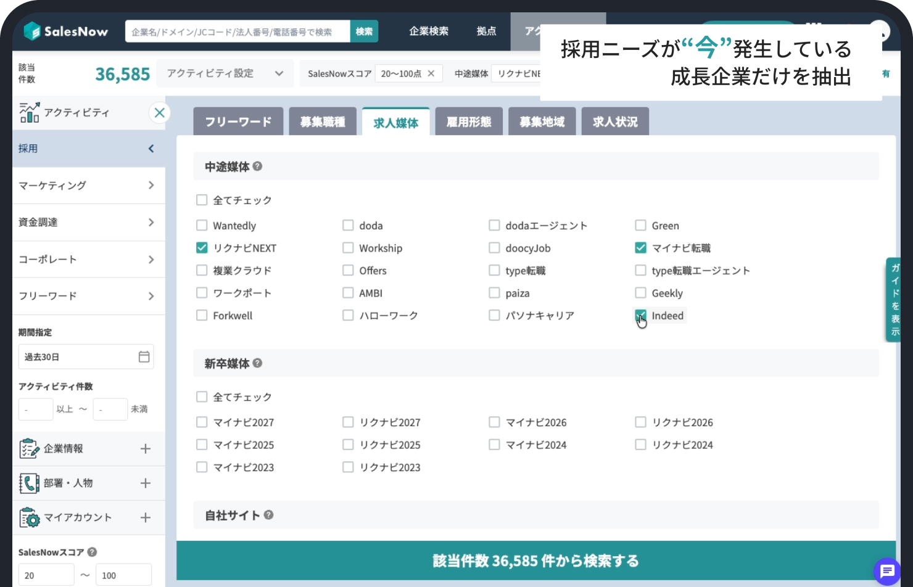

---

## Business Requirements & Growth Outlook

> Full analysis: [docs/business-requirements.md](docs/business-requirements.md) · *Estimates based on public data, not official financials.*

### Revenue & Profit Estimate (Independent)

| Metric | FY2025E | FY2026E | FY2027E | Direction |
|--------|---------|---------|---------|-----------|
| ARR (JPY) | ¥2.0–2.8B | ¥3.2–4.5B | ¥4.8–6.5B | **Positive** |
| YoY Growth | +45% | +40% | +35% | **Positive** |
| Gross Margin | 72% | 75% | 78% | **Positive** |
| EBITDA Margin | -5% | +8% | +15% | **Turning positive** |
| Data Infra / ARR | 14% | 11% | 9% | **Improving** |

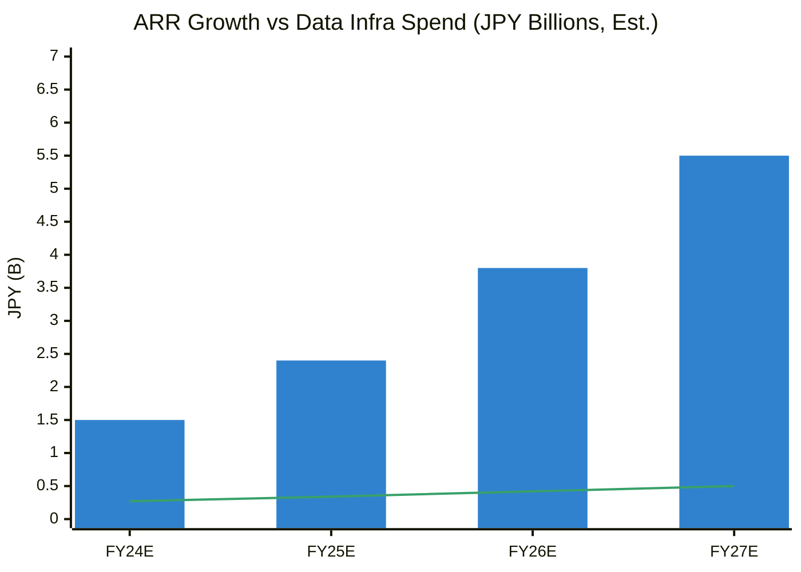

### Market Share & Business Growth

| Period | Market Position | Records | Growth |
|--------|----------------|---------|--------|
| 2024 | ~15–20% share (est.) | ~10M | Expansion phase |
| 2025 | **No.1 certified** (JMR Oct 2025) | **14M+** | **Positive** |
| 2027E | 25–30% share (est.) | 18M+ | Continued growth |

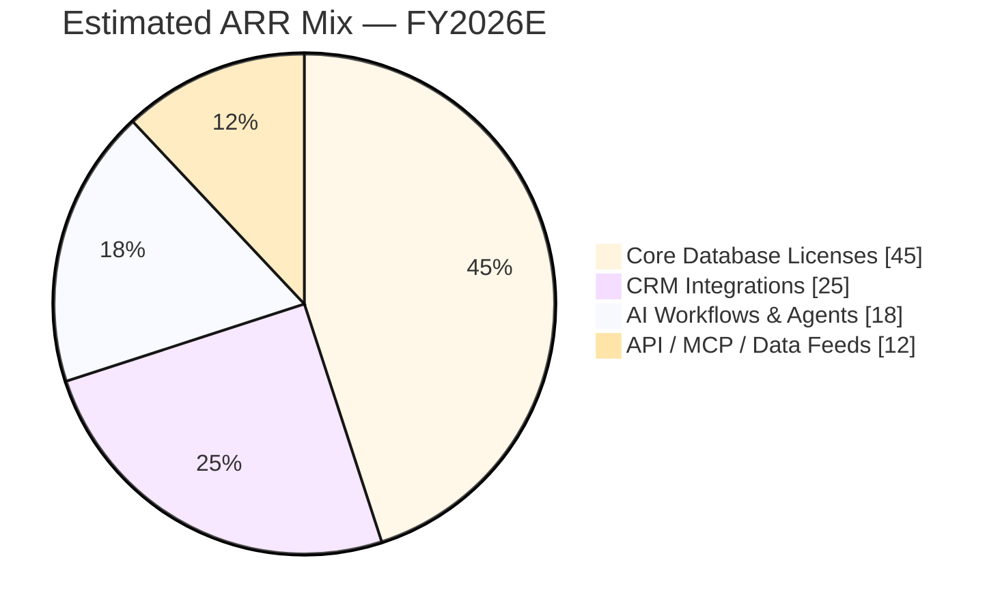

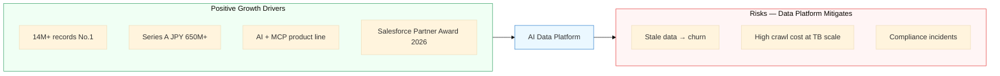

---

## Delivery Context (from 2026-06-26 SalesNow discussion)

This design is grounded in how SalesNow actually runs today. Full notes: [docs/team-and-delivery.md](docs/team-and-delivery.md).

**Confirmed pipeline shape:** `ingest → raw → transform → final layer → AI features (scoring + embedding) → consumers`

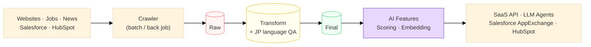

**Key requirements raised in the call, now reflected in this repo:**

| Requirement | Where it lives |
|-------------|----------------|
| Quality control after crawl, **before** AI (multi-language / Japanese checks) | `src/quality/language_validator.py` |
| Retry & error handling for batch crawler + stream consumers | `src/ingestion/retry.py` |
| Team: ~4–5 data engineers + 1–2 backend engineers maintain pipelines & DB | [team-and-delivery.md](docs/team-and-delivery.md) |
| AI features = lead scoring **and** embeddings consumed by API/agents | architecture diagrams |

---

## Product Context

SalesNow helps sales teams answer three questions with data:

1. **Who** should we target? — High-precision list creation in under 1 minute
2. **When** should we reach out? — Activity signals (hiring, funding, news)
3. **What** should we say? — AI-generated company summaries & hook talks

| Feature | Description | Image |
|---------|-------------|-------|
| **List Creation** | Filter 14M+ records by industry, size, intent, hiring | 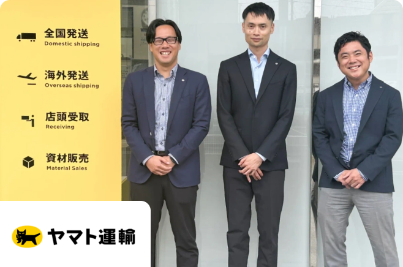 |
| **CRM Integration** | Salesforce/HubSpot sync + deal history analysis | 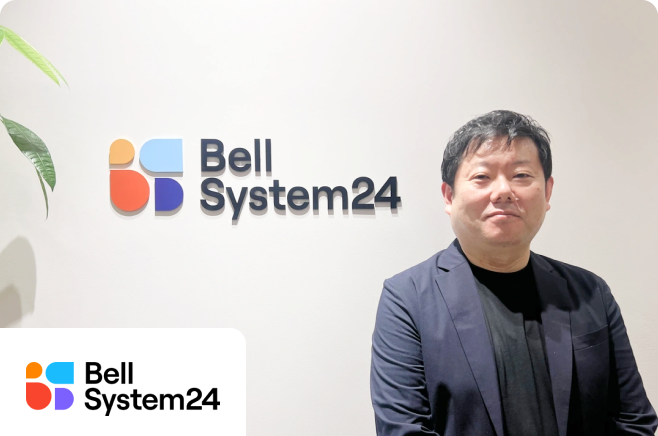 |
| **Company Research** | News, IR, jobs, employee growth, AI summary | 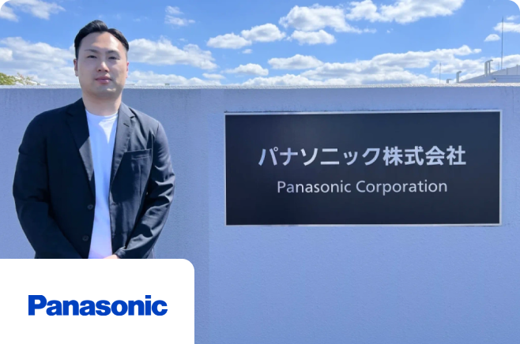 |

---

## Solution Architecture

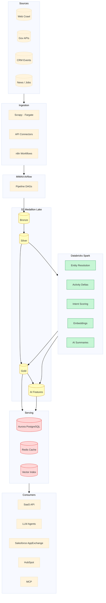

Detailed diagrams: [docs/architecture.md](docs/architecture.md) · Delivery & team context: [docs/team-and-delivery.md](docs/team-and-delivery.md)

---

## Data Pipelines

### Master Pipeline — End-to-End Flow

```mermaid
%%{init: {'theme': 'base'}}%%
flowchart LR
    subgraph P1["1 · Ingest"]
        A1["Scrapy Crawl<br/>every 6h"]
        A2["Gov API Sync<br/>daily"]
        A3["CRM Webhooks<br/>real-time"]
    end

    subgraph P2["2 · Transform"]
        B1["Bronze → Silver<br/>hourly"]
        B2["Dedup & Validate<br/>GE checks"]
        B3["Silver → Gold<br/>daily"]
    end

    subgraph P3["3 · Enrich"]
        C1["Entity Resolution<br/>名寄せ"]
        C2["Activity Deltas<br/>every 15m"]
        C3["AI Features<br/>daily"]
    end

    subgraph P4["4 · Serve"]
        D1["Aurora Upsert"]
        D2["CRM Push<br/>every 5m"]
        D3["API + MCP"]
    end

    P1 --> P2 --> P3 --> P4

    style P1 fill:#e9d8fd,stroke:#805ad5
    style P2 fill:#fefcbf,stroke:#d69e2e
    style P3 fill:#c6f6d5,stroke:#38a169
    style P4 fill:#ebf8ff,stroke:#3182ce
```

### Pipeline Schedule & SLA

```mermaid
%%{init: {'theme': 'base'}}%%
gantt
    title Daily Pipeline Schedule (JST)
    dateFormat HH:mm
    axisFormat %H:%M

    section Ingestion
    crawl_corporate_sites (6h cycle)     :00:00, 6h
    ingest_government_master             :02:00, 1h
    crm_enrichment_sync (5m cycle)       :00:00, 24h

    section Transform
    silver_cleansing (hourly)            :00:00, 24h
    activity_signal_detection (15m)    :00:00, 24h
    gold_dimensional_model               :04:00, 2h

    section AI
    ai_feature_generation                :05:00, 2h
    data_quality_monitoring (hourly)     :00:00, 24h
```

| DAG | Schedule | SLA | Output |
|-----|----------|-----|--------|
| `crawl_corporate_sites` | Every 6h | Bronze within 30m | S3 bronze/crawl/ |
| `silver_cleansing` | Hourly | 99.5% pass rate | S3 silver/ |
| `activity_signal_detection` | Every 15m | p95 < 60 min fresh | gold/fact_activity |
| `crm_enrichment_sync` | Every 5m | < 5 min end-to-end | Salesforce fields |
| `ai_feature_generation` | Daily 05:00 | < 2s API p95 cached | intent_scores, summaries |

### Activity Signal Pipeline

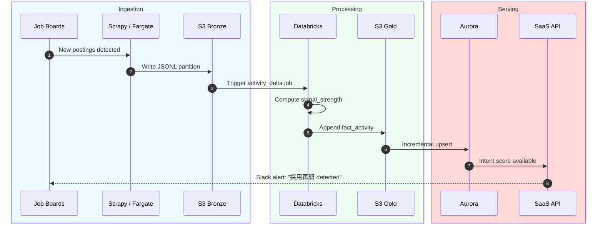

---

## Engineering Code Samples

### 1. Scrapy Ingestion → S3 Bronze

```python
# src/ingestion/spiders/corporate_profile.py
from datetime import datetime, timezone
import scrapy

class CorporateProfileSpider(scrapy.Spider):
    name = "corporate_profile"
    custom_settings = {"DOWNLOAD_DELAY": 1.5, "ROBOTSTXT_OBEY": True}

    def parse(self, response):
        yield {
            "source": "corporate_profile",
            "crawl_timestamp": datetime.now(timezone.utc).isoformat(),
            "company_name": response.css("h1.company-name::text").get(),
            "corporate_number": response.css("[data-corporate-number]::attr(data-corporate-number)").get(),
            "employee_count": self._extract_int(response, ".employee-count"),
        }
```

### 2. Entity Resolution — PySpark

```python
# src/processing/spark_jobs/entity_resolution.py
from pyspark.sql import functions as F
from pyspark.sql.window import Window

def resolve_entities(silver_df):
    window = Window.partitionBy("corporate_number").orderBy(F.desc("updated_at"))
    return (
        silver_df.filter(F.col("corporate_number").isNotNull())
        .withColumn("row_num", F.row_number().over(window))
        .filter(F.col("row_num") == 1)
        .drop("row_num")
    )
```

### 3. Data Quality Validation

```python
# src/quality/validator.py
from src.quality.validator import CompanyRecordValidator

validator = CompanyRecordValidator()
result = validator.validate_batch(records)

assert result.pass_rate >= 0.995, f"SLA breach: {result.pass_rate:.1%}"
# Checks: 法人番号 format, postal code, employee_count, required fields
```

### 4. Intent Scoring

```python
# src/ai/intent_scoring.py
from src.ai.intent_scoring import ActivityFeatures, compute_intent_score

features = ActivityFeatures(
    job_postings_30d=15,
    job_postings_prev_30d=5,
    employee_growth_rate=0.2,
    funding_events_90d=1,
)
score = compute_intent_score("company-uuid", features)
# → composite_score: 0.72 (hiring + growth + funding weighted)
```

### 5. Airflow DAG Orchestration

```python
# infra/airflow/dags/salesnow_daily_pipeline.py
from airflow import DAG
from airflow.providers.amazon.aws.operators.ecs import EcsRunTaskOperator

with DAG("salesnow_daily_pipeline", schedule_interval="0 2 * * *") as dag:
    crawl = EcsRunTaskOperator(
        task_id="crawl_corporate_sites",
        cluster="salesnow-crawl-cluster",
        task_definition="scrapy-corporate-profile",
        launch_type="FARGATE",
    )
    crawl >> silver_cleansing >> gold_dimensional >> quality_check
```

### 6. Japanese / Multi-language Quality Gate

```python
# src/quality/language_validator.py
from src.quality.language_validator import validate_for_japanese_ui

# Content is shown to Japanese users → validate before feeding the LLM layer
errors = validate_for_japanese_ui(company_summary_text, require_japanese=True)
if errors:                       # e.g. mojibake / wrong language
    route_to_quarantine(record, errors)   # don't feed to scoring / embedding
```

### 7. Crawler Retry & Dead-letter (Batch Resilience)

```python
# src/ingestion/retry.py
from src.ingestion.retry import RetryPolicy, process_batch

policy = RetryPolicy(max_attempts=5, base_delay_s=1.0, max_delay_s=60.0)
dead_letters = process_batch(crawl_records, handler=push_to_s3, policy=policy)
# One bad record never fails the whole back job; failures go to the DLQ for replay
```

### 6. Aurora Serving Schema

```sql
-- sql/migrations/001_initial_schema.sql
CREATE TABLE companies (
    company_id       UUID PRIMARY KEY DEFAULT uuid_generate_v4(),
    corporate_number VARCHAR(13) UNIQUE,
    company_name     VARCHAR(500) NOT NULL,
    employee_count   INTEGER,
    updated_at       TIMESTAMPTZ NOT NULL DEFAULT NOW()
);

CREATE INDEX idx_companies_name_trgm ON companies USING gin (company_name gin_trgm_ops);
```

---

## Repository Structure

```
salesnow-ai-data-platform/
├── docs/
│   ├── business-requirements.md  # Revenue, market share, growth analysis
│   ├── architecture.md           # Mermaid architecture & pipeline diagrams
│   ├── data-model.md             # Entity relationships
│   └── images/                   # Product screenshots from salesnow.jp
├── src/
│   ├── ingestion/                # Scrapy spiders, S3 bronze writer
│   ├── processing/               # Spark transforms, enrichment
│   ├── quality/                  # Validation & monitoring
│   └── ai/                       # Intent scoring, feature generation
├── infra/
│   ├── airflow/dags/             # MWAA pipeline definitions
│   └── databricks/notebooks/     # PySpark batch jobs
├── sql/migrations/               # Aurora PostgreSQL DDL
└── tests/                        # Unit tests
```

---

## Tech Stack

| Layer | Technology |
|-------|------------|
| **Ingestion** | Python (Scrapy), AWS Fargate, Amazon MWAA |
| **Storage** | Amazon S3, Amazon Aurora PostgreSQL |
| **Processing** | Apache Spark (Databricks) |
| **AI / Workflow** | LLM enrichment, n8n, MCP |
| **Quality** | Great Expectations, Slack alerts |

---

## Quick Start

```bash
git clone https://github.com/willtran112358/salesnow-ai-data-platform.git
cd salesnow-ai-data-platform
python -m venv .venv && source .venv/bin/activate
pip install -r requirements.txt

python -m src.quality.validator --dataset sample
python -m src.processing.enrichment --company "株式会社SalesNow"
pytest tests/ -v
```

---

## Roadmap

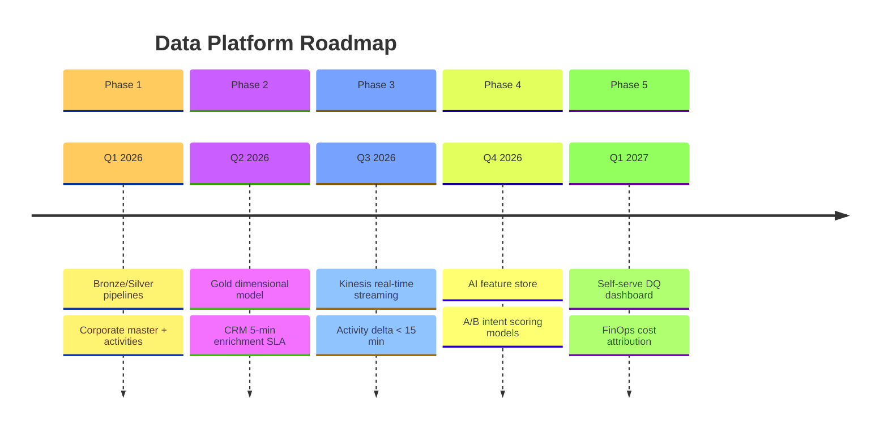

---

## About SalesNow

| | |
|---|---|
| **Company** | 株式会社SalesNow (SalesNow Co., Ltd.) |
| **Founded** | 2019, Tokyo |
| **Funding** | Series A (JPY 650M+, Nov 2024) |
| **Website** | [salesnow.jp](https://salesnow.jp/) |
| **Careers** | [Data Engineer — AI-driven Data Platform](https://herp.careers/v1/salesnow0801/aLtdW6WbCZ0h) |

---

## Disclaimer

Independent architecture proposal for portfolio and interview preparation. Not affiliated with SalesNow Co., Ltd. Financial figures are estimates. Product images from [salesnow.jp](https://salesnow.jp/).

## License

MIT — see [LICENSE](LICENSE).
