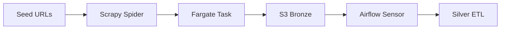

# SalesNow AI Data Platform — Architecture

## 1. Business Context

SalesNow operates Japan's largest B2B corporate database (14M+ records). The data platform must:

- Ingest heterogeneous web and API sources at scale (tens of TB)
- Maintain sub-minute freshness for high-value activity signals
- Power AI features: company summaries, intent scoring, hook-talk generation
- Sync enriched data to Salesforce, HubSpot, and the SalesNow SaaS API

## 2. Medallion Architecture

### Bronze (Raw Landing Zone)

```
s3://salesnow-data-lake/bronze/
├── crawl/corporate_sites/dt=2026-06-25/hour=14/
├── crawl/job_boards/dt=2026-06-25/
├── api/gbizinfo/dt=2026-06-25/
├── api/edinet/dt=2026-06-25/
└── crm/salesforce/webhooks/dt=2026-06-25/
```

- **Format**: JSON Lines, gzip compressed
- **Partitioning**: `source`, `dt`, `hour`
- **Retention**: 90 days → S3 Glacier

### Silver (Cleansed & Conformed)

```
s3://salesnow-data-lake/silver/
├── companies/
├── activities/
├── contacts/
└── crm_deals/
```

- Deduplication via 法人番号 (corporate number)
- Schema enforcement with Great Expectations
- PII handling: opt-out registry filtering

### Gold (Analytics & Serving)

```
s3://salesnow-data-lake/gold/
├── dim_company/
├── dim_industry/
├── fact_activity/
├── fact_employee_trend/
└── mart_intent_scores/
```

- Star schema optimized for ABM segmentation
- Incremental loads to Aurora PostgreSQL serving layer

## 3. Ingestion Patterns

### Web Crawling (Scrapy on ECS Fargate)



- **Spiders**: `corporate_profile`, `job_posting`, `news_article`, `ir_filing`
- **Rate limiting**: Per-domain politeness (1–3 req/s)
- **Robots.txt**: Strict compliance + opt-out honor

### Government Master Data

| Source | Data | Frequency |
|--------|------|-----------|
| gBizINFO | 法人番号, 社名, 住所, 業種 | Daily |
| EDINET | 有価証券報告書, financials | Daily |
| 国税庁 | Corporate registry updates | Weekly |

### CRM Webhooks

- Salesforce: Lead/Account/Opportunity change events
- HubSpot: Company/Deal property updates
- 5-minute enrichment SLA for new leads (per SmartDrive case study)

## 4. Processing (Databricks / PySpark)

### Key Jobs

| Job | Input | Output | SLA |
|-----|-------|--------|-----|
| `entity_resolution` | silver/companies | gold/dim_company | Daily |
| `activity_delta_detection` | silver/activities | gold/fact_activity | 15 min |
| `employee_trend_calc` | crawl snapshots | gold/fact_employee_trend | Daily |
| `intent_scoring` | gold marts | ai-features/intent_scores | Daily |
| `ai_summary_batch` | gold + raw text | ai-features/summaries | Daily |

### Entity Resolution Logic

```
Match priority:
1. Exact 法人番号 match
2. Normalized company name + prefecture
3. Fuzzy name (Levenshtein < 0.15) + address overlap
4. Manual review queue for ambiguous matches
```

## 5. Serving Layer (Aurora PostgreSQL)

### Core Tables

- `companies` — Master company record (14M rows, partitioned by prefecture)
- `company_attributes` — EAV for flexible enrichment fields
- `activities` — Time-series signals (jobs, news, funding)
- `contacts` — Department-level contact data (7.5M+)
- `ai_summaries` — Pre-computed LLM summaries with TTL
- `intent_scores` — Daily refreshed scoring

### Read Patterns

| Consumer | Pattern | Index Strategy |
|----------|---------|----------------|
| Search API | Filter + pagination | GIN on industry, employee_count |
| Company detail | Single company join | PK on corporate_number |
| CRM sync | Batch upsert by SF ID | B-tree on external_id |
| MCP / AI agents | JSON API export | Materialized views |

## 6. Data Quality Monitoring

### SLAs

| Metric | Target | Alert Channel |
|--------|--------|---------------|
| Corporate master completeness | ≥ 99.5% | Slack #data-alerts |
| Activity freshness (p95) | < 60 min | PagerDuty |
| Entity resolution match rate | ≥ 98% | Weekly report |
| CRM enrichment latency | < 5 min | Slack #crm-sync |
| Duplicate rate | < 0.1% | Dashboard |

### Validation Rules (examples)

```python
expect_column_values_to_not_be_null("corporate_number")
expect_column_values_to_match_regex("postal_code", r"^\d{3}-?\d{4}$")
expect_column_pair_values_A_to_be_greater_than_B("updated_at", "created_at")
expect_table_row_count_to_be_between(min_value=13_000_000, max_value=15_000_000)
```

## 7. AI Integration Points

### Batch Features (Databricks)

- Company embeddings from news + job descriptions
- Intent score (XGBoost on activity features)
- EC switch score (website tech detection)

### Real-time Features (n8n + API)

- Lost-deal re-engagement scanner (weekly Slack digest)
- Form auto-complete enrichment (on company name select)
- MCP server for Claude/Cursor company lookup

## 8. Security & Compliance

- **個人情報保護法**: Opt-out registry; only publicly available PII
- **Encryption**: S3 SSE-KMS, Aurora encryption at rest, TLS in transit
- **Access**: IAM roles per pipeline; no long-lived credentials
- **Audit**: CloudTrail for S3/API access; pipeline run logs in Airflow

## 9. Disaster Recovery

| Component | RPO | RTO |
|-----------|-----|-----|
| S3 data lake | 0 (versioning) | < 1h |
| Aurora PostgreSQL | 5 min (PITR) | < 30 min |
| Airflow DAG state | 1h | < 2h |
| Databricks jobs | Re-run from checkpoint | < 4h |
