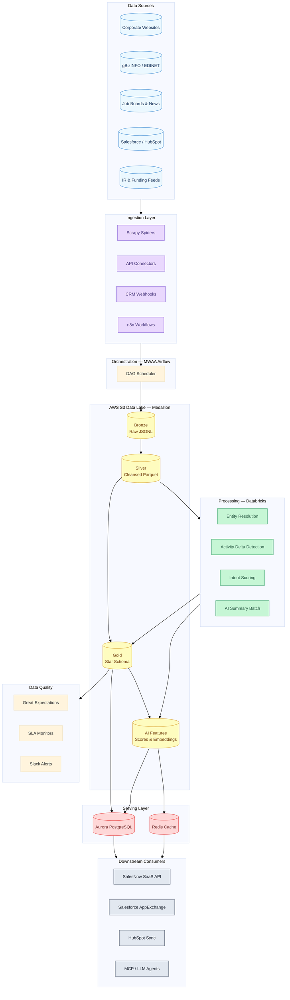
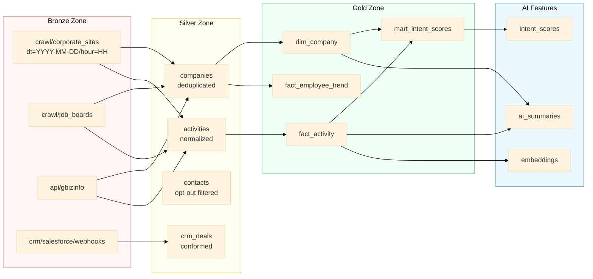
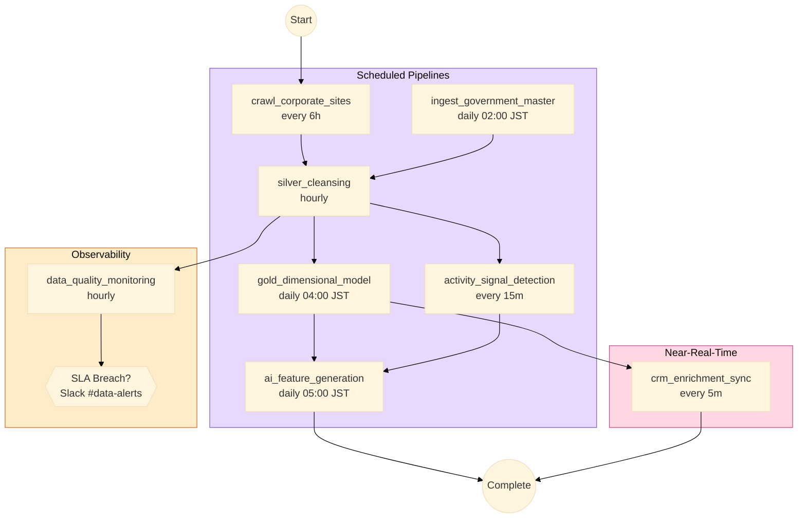
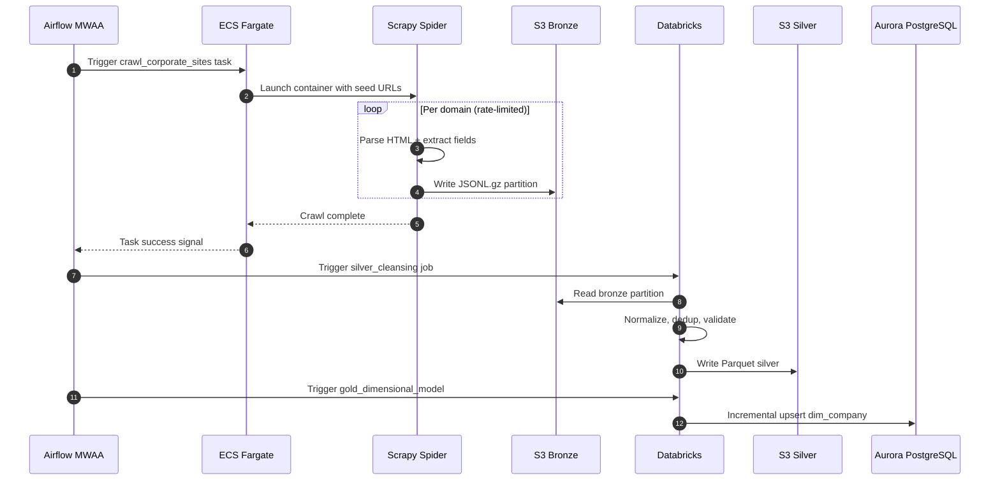
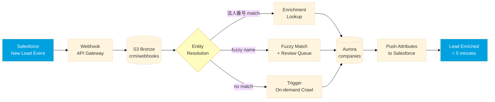
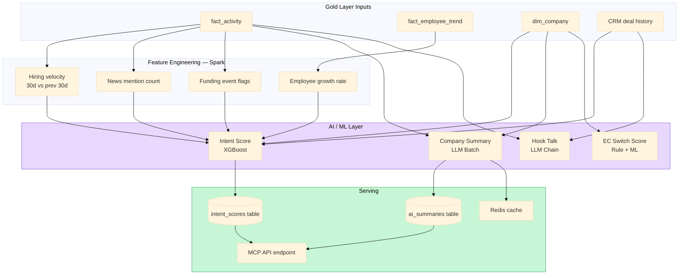
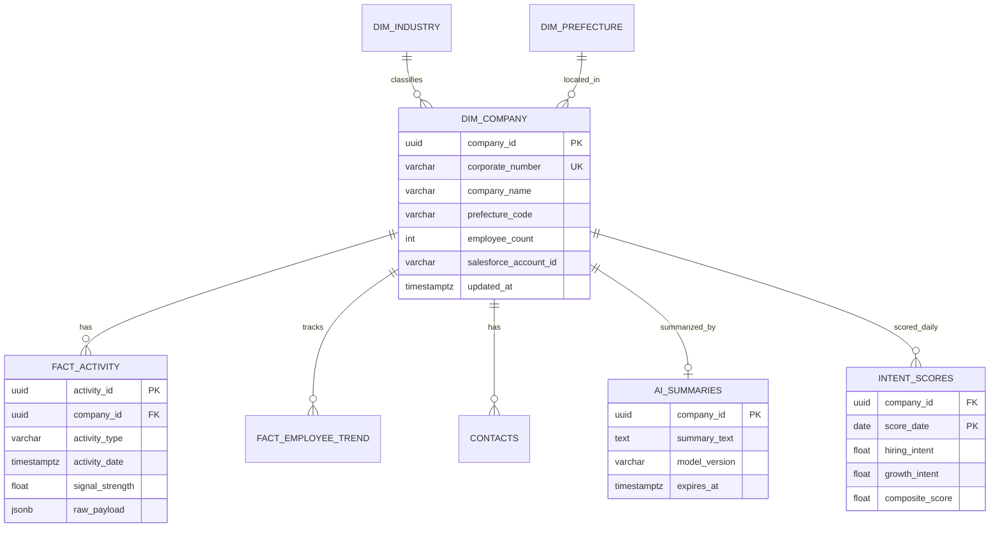
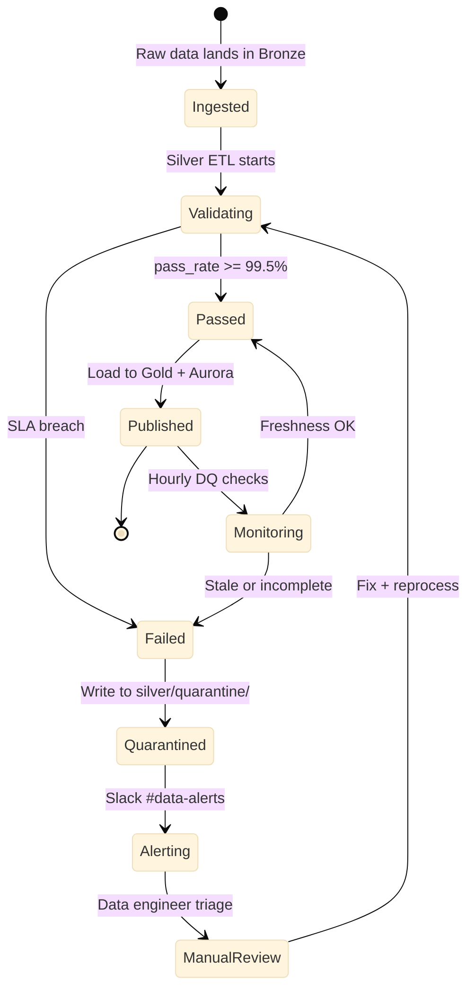
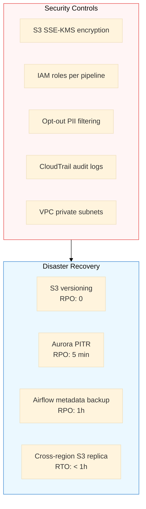

# SalesNow AI Data Platform — Architecture

## 1. Business Context

SalesNow operates Japan's largest B2B corporate database (14M+ records). The data platform must:

- Ingest heterogeneous web and API sources at scale (tens of TB)
- Maintain sub-minute freshness for high-value activity signals
- Power AI features: company summaries, intent scoring, hook-talk generation
- Sync enriched data to Salesforce, HubSpot, and the SalesNow SaaS API

See [business-requirements.md](business-requirements.md) for revenue, market share, and growth analysis.

---

## 2. End-to-End Solution Architecture

---

## 3. Data Pipeline — Medallion Flow

---

## 4. Pipeline DAG Orchestration

---

## 5. Web Crawl Pipeline Detail

---

## 6. CRM Enrichment Pipeline (5-Min SLA)

---

## 7. AI Feature Pipeline

---

## 8. Data Model (ER Diagram)

---

## 9. Data Quality Monitoring Flow

### SLAs

| Metric | Target | Alert Channel |
|--------|--------|---------------|
| Corporate master completeness | ≥ 99.5% | Slack #data-alerts |
| Activity freshness (p95) | < 60 min | PagerDuty |
| Entity resolution match rate | ≥ 98% | Weekly report |
| CRM enrichment latency | < 5 min | Slack #crm-sync |
| Duplicate rate | < 0.1% | Dashboard |

---

## 10. Security & Disaster Recovery

| Component | RPO | RTO |
|-----------|-----|-----|
| S3 data lake | 0 (versioning) | < 1h |
| Aurora PostgreSQL | 5 min (PITR) | < 30 min |
| Airflow DAG state | 1h | < 2h |
| Databricks jobs | Re-run from checkpoint | < 4h |
