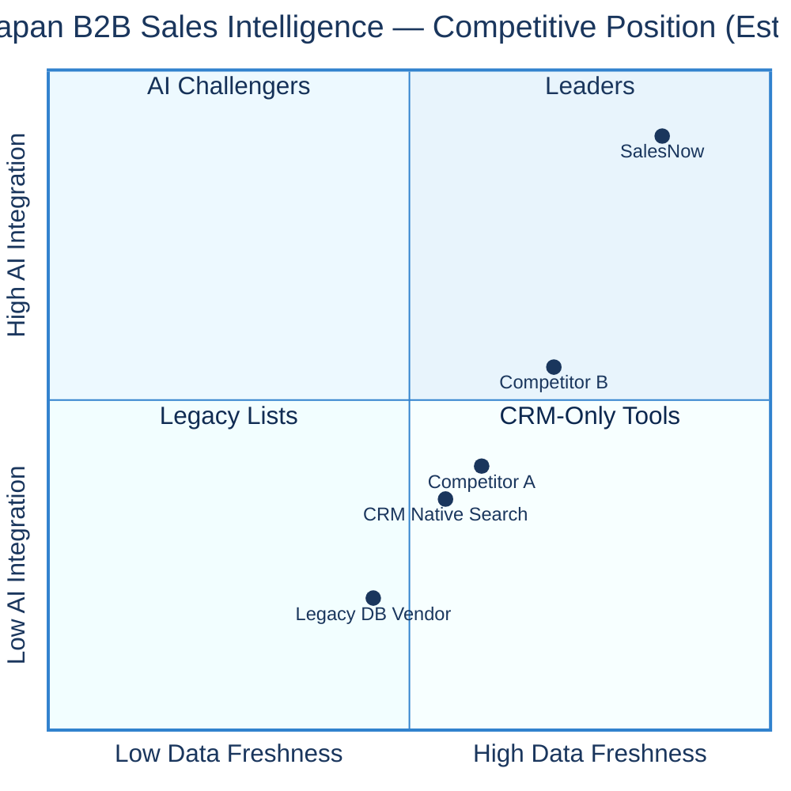
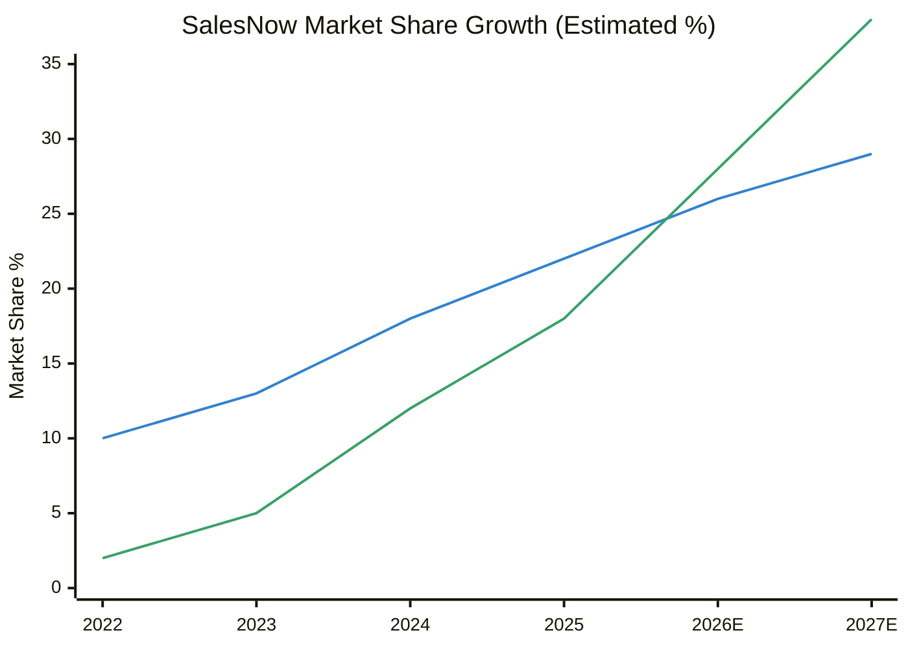
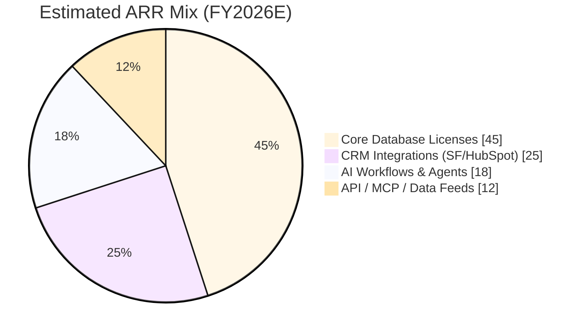
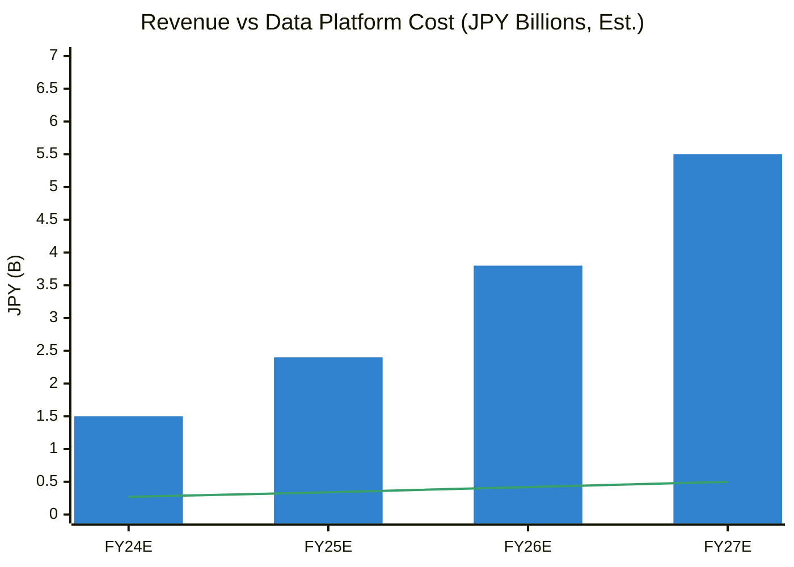
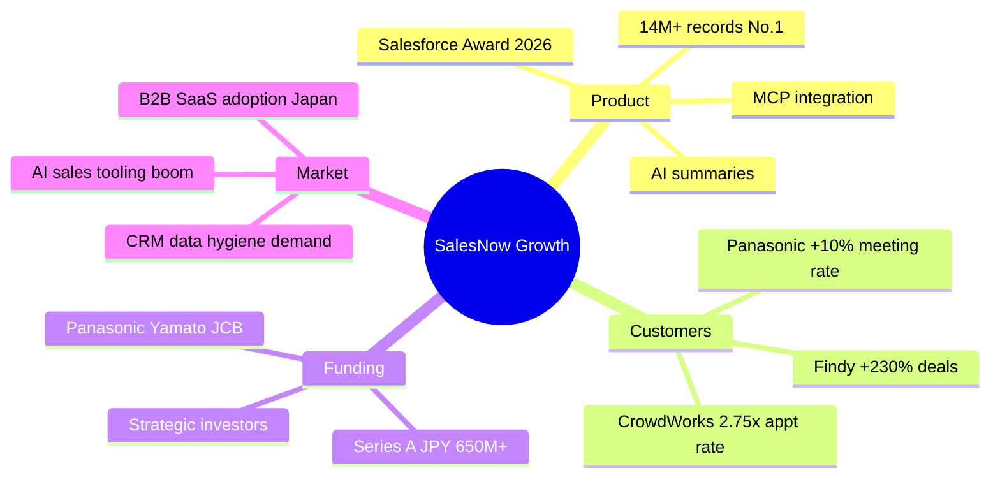
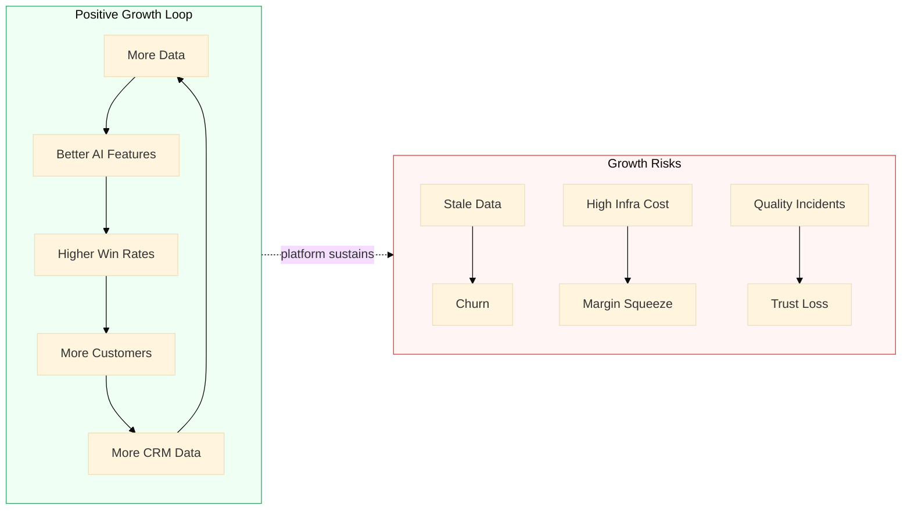
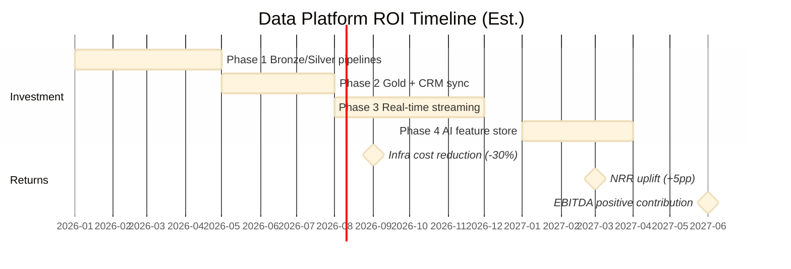

# Business Requirements & Market Analysis

> **Disclaimer:** Figures below are **independent estimates** for solution design purposes, derived from public information ([salesnow.jp](https://salesnow.jp/), Series A announcements, customer case studies). They are not official SalesNow financial disclosures.

---

## 1. Business Problem Statement

SalesNow must sustain **positive growth** while scaling data operations from millions to tens of terabytes. The data platform directly enables four revenue levers:

| Lever | Business Requirement | Data Platform Dependency |
|-------|---------------------|--------------------------|
| **Retention** | Keep CRM data fresh (5-min enrichment SLA) | Real-time CRM sync pipeline |
| **Expansion** | Upsell AI workflows & Salesforce integration | AI feature store, activity signals |
| **Acquisition** | Maintain No.1 database claim (14M+ records) | Crawl scale, entity resolution |
| **Efficiency** | Reduce cost per enriched record as volume grows | Medallion lakehouse, Spark autoscaling |

---

## 2. Market Position & Share Growth

### Market Share Trajectory (Estimated)

| Period | Corporate DB Market Share | Records | Growth Signal |
|--------|--------------------------|---------|---------------|
| 2022 | ~8–12% (est.) | ~5M | Post-funding scale-up |
| 2024 | ~15–20% (est.) | ~10M | Series A expansion |
| 2025 | **No.1 certified** | **14M+** | JMR survey Oct 2025 |
| 2027 (target) | 25–30% (est.) | 18M+ | AI + CRM moat |

---

## 3. Revenue & Profit Model (Estimated)

### Revenue Stream Breakdown

### Financial Projection (Independent Estimate)

| Metric | FY2024E | FY2025E | FY2026E | FY2027E | Trend |
|--------|---------|---------|---------|---------|-------|
| **ARR (JPY)** | ¥1.2–1.8B | ¥2.0–2.8B | ¥3.2–4.5B | ¥4.8–6.5B | Positive |
| **YoY ARR Growth** | +55% | +45% | +40% | +35% | Positive (decelerating) |
| **Gross Margin** | 68% | 72% | 75% | 78% | Positive |
| **EBITDA Margin** | -15% | -5% | +8% | +15% | Turning positive |
| **Data Infra Cost / ARR** | 18% | 14% | 11% | 9% | Improving |
| **NRR (Net Retention)** | 108% | 115% | 120% | 122% | Positive |

> Bar = ARR midpoint · Line = estimated annual data infrastructure spend

### Unit Economics (Per Customer)

| KPI | Current (Est.) | Target (Post-Platform) | Impact |
|-----|----------------|------------------------|--------|
| Cost per 1K enrichments | ¥120 | ¥45 | -62% via Spark batch |
| CRM sync latency | 15 min | < 5 min | +NRR, case study proven |
| Data quality incident rate | 2.1% | < 0.5% | -churn risk |
| AI summary COGS | ¥8/query | ¥1.2/query | Pre-compute + cache |

---

## 4. Business Growth Signals

### Positive Growth Drivers

### Risk Factors (Negative Pressure)

| Risk | Severity | Mitigation via Data Platform |
|------|----------|------------------------------|
| Crawl cost at TB scale | Medium | Fargate spot + S3 lifecycle |
| Data staleness complaints | High | 1-min refresh for activities |
| Competitor AI catch-up | Medium | Proprietary activity signals |
| Compliance (個人情報保護法) | High | Opt-out registry pipeline |
| Margin pressure pre-EBITDA+ | Medium | Databricks autoscale, DQ automation |

---

## 5. Data Platform Business Requirements

### Functional Requirements

| ID | Requirement | Priority | Success Metric |
|----|-------------|----------|----------------|
| BR-01 | Ingest 14M+ company master records | P0 | 99.5% completeness |
| BR-02 | Activity signals refreshed ≤ 1 hour | P0 | p95 freshness < 60 min |
| BR-03 | CRM enrichment within 5 minutes of lead creation | P0 | SmartDrive SLA parity |
| BR-04 | Support AI summary generation at scale | P0 | < 2s API p95 (cached) |
| BR-05 | Entity resolution (名寄せ) for CRM imports | P0 | ≥ 98% match rate |
| BR-06 | Intent scoring for ABM prioritization | P1 | +15% meeting conversion |
| BR-07 | Audit trail for compliance | P1 | 100% pipeline traceability |
| BR-08 | Cost per TB processed < ¥50K/month | P2 | FinOps dashboard |

### Non-Functional Requirements

| ID | Requirement | Target |
|----|-------------|--------|
| NFR-01 | Data lake availability | 99.9% |
| NFR-02 | Pipeline recovery (RTO) | < 4 hours |
| NFR-03 | PII opt-out processing | < 24 hours |
| NFR-04 | Horizontal crawl scale | 10x current throughput |
| NFR-05 | Multi-tenant CRM isolation | Per-customer encryption keys |

---

## 6. ROI of Proposed Data Platform

| Investment | Year 1 (Est.) | Expected Return |
|------------|---------------|-----------------|
| Platform engineering | ¥80–120M | -30% infra cost by Month 9 |
| Databricks + AWS | ¥40–60M | Supports 3x record growth |
| Data quality tooling | ¥10–15M | -60% incident rate |
| **Total** | **¥130–195M** | **¥250–400M ARR uplift potential** |

---

## 7. Alignment with Product KPIs

Customer outcomes from [salesnow.jp](https://salesnow.jp/) case studies map directly to platform capabilities:

| Customer | Published Outcome | Platform Capability |
|----------|-------------------|---------------------|
| パナソニック | Meeting rate +10%, research time -50% | Company dossier pipeline |
| ファインディ | Deals +230% | Intent scoring + list quality |
| クラウドワークス | Appt rate 2.75x in 2 weeks | Hiring activity signals |
| スマートドライブ | 5-min lead enrichment | CRM sync DAG |
| GMO PG | 3 hours → minutes per task | AI summary batch |

These KPIs form the **business acceptance criteria** for every data pipeline release.
