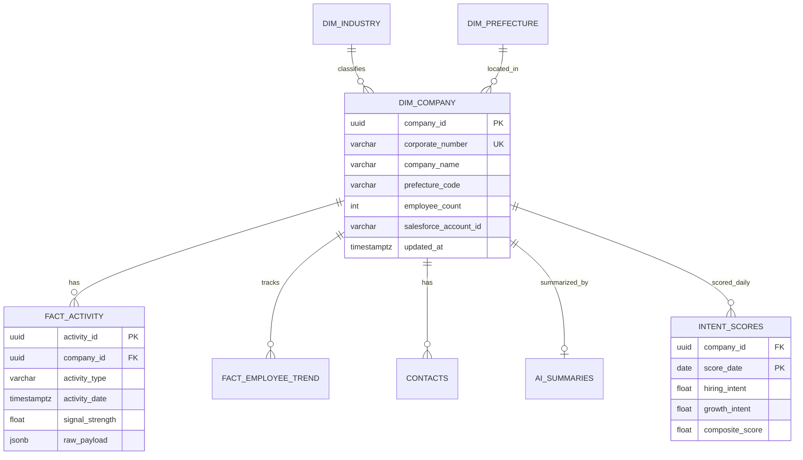
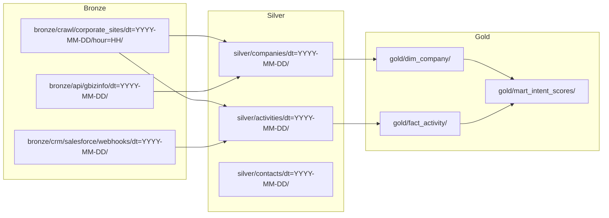

# Data Model

## Entity Relationship

## S3 Partition Flow

## dim_company

| Column | Type | Description |
|--------|------|-------------|
| `company_id` | UUID | Surrogate key |
| `corporate_number` | VARCHAR(13) | 法人番号 (natural key) |
| `company_name` | VARCHAR(500) | Official name |
| `company_name_normalized` | VARCHAR(500) | For matching |
| `prefecture_code` | CHAR(2) | JIS prefecture |
| `address` | TEXT | Headquarters address |
| `industry_code` | VARCHAR(10) | JSIC industry code |
| `employee_count` | INTEGER | Latest headcount |
| `capital_amount` | BIGINT | 資本金 (JPY) |
| `listing_status` | VARCHAR(20) | 上場区分 |
| `founded_date` | DATE | 設立年月 |
| `website_url` | VARCHAR(500) | Corporate website |
| `salesforce_account_id` | VARCHAR(18) | CRM external ID |
| `hubspot_company_id` | VARCHAR(50) | CRM external ID |
| `created_at` | TIMESTAMPTZ | Record creation |
| `updated_at` | TIMESTAMPTZ | Last enrichment |

## fact_activity

| Column | Type | Description |
|--------|------|-------------|
| `activity_id` | UUID | Surrogate key |
| `company_id` | UUID | FK → dim_company |
| `activity_type` | VARCHAR(50) | `job_posting`, `news`, `funding`, `ir_filing` |
| `activity_date` | TIMESTAMPTZ | Event timestamp |
| `title` | TEXT | Headline / job title |
| `source_url` | VARCHAR(1000) | Origin URL |
| `signal_strength` | FLOAT | 0.0–1.0 relevance score |
| `raw_payload` | JSONB | Original extracted data |

## intent_scores

| Column | Type | Description |
|--------|------|-------------|
| `company_id` | UUID | FK → dim_company |
| `score_date` | DATE | Scoring date |
| `hiring_intent` | FLOAT | Job posting velocity signal |
| `growth_intent` | FLOAT | Employee count trend |
| `funding_intent` | FLOAT | Capital event signal |
| `composite_score` | FLOAT | Weighted combination |
| `model_version` | VARCHAR(20) | Scoring model ID |
