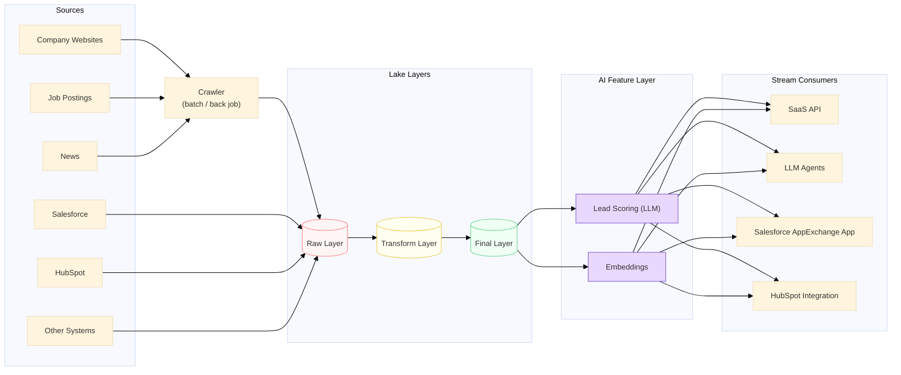
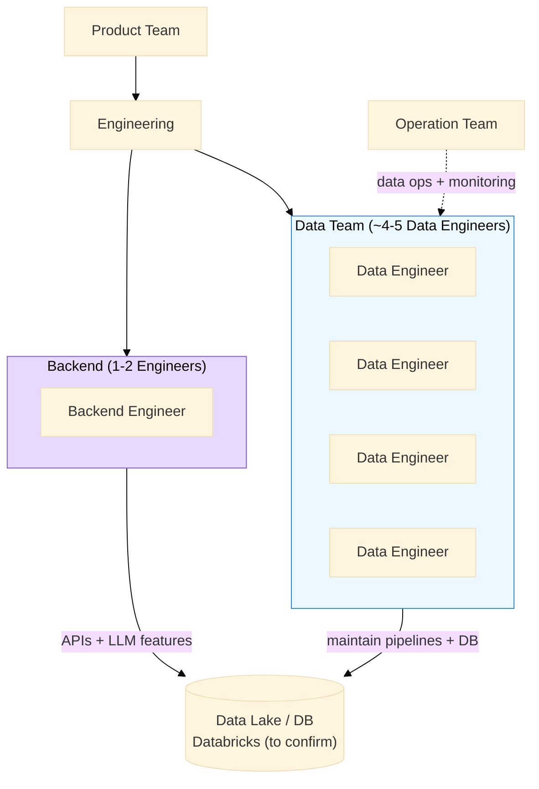

# Team, Delivery & Confirmed Data Flow

> Captured from the **2026-06-26 product & engineering discussion** with SalesNow.
> This document grounds the platform design in how SalesNow actually operates today.
> Some internal tool names were heard verbally and are marked *(to confirm)*.

---

## 1. Confirmed Data Flow

The discussion confirmed SalesNow's core pipeline shape:

```
ingest → raw → transform → final layer → AI features (scoring + embedding) → consumers
```



### Mapping to this repo's medallion model

| Discussion term | This repo's layer | Notes |
|-----------------|-------------------|-------|
| Crawler ingest | Bronze | Batch back job, JSONL → S3 |
| Raw layer | Bronze | Raw landing zone |
| Transform layer | Silver | Cleansed, deduplicated, **language-validated** |
| Final layer | Gold | Business-ready, conformed |
| AI features (scoring) | `ai-features/intent_scores` | LLM + ML scoring |
| AI features (embedding) | `ai-features/embeddings` | Vector representations |

---

## 2. Team Structure (as discussed)



| Role | Approx. count | Responsibility |
|------|---------------|----------------|
| Data Engineer | 4–5 | Build & maintain crawl → transform → AI pipelines, data lake & DB |
| Backend Engineer | 1–2 | APIs, LLM-based features, CRM integrations |
| Product / Engineering / Ops | — | Requirements, delivery, operations |

A Data Engineer here is expected to be a **pillar role** spanning ingestion, transformation, quality, and the AI feature layer.

---

## 3. AI Tooling in the Product & Workflow

| Tool | Use | Status |
|------|-----|--------|
| Claude Code ("cloud code") | AI-assisted development & refactoring | Confirmed in JD + call |
| Cursor | AI-assisted coding | Confirmed in JD |
| LLM model (in-product) | Lead scoring, CRM features, summaries | Confirmed in call |
| "aTunes / iTunes" | Internal AI tool *(name to confirm)* | Heard verbally |
| n8n | AI workflow orchestration | From JD |
| CodeRabbit | AI PR review | From JD |

---

## 4. Operational Requirements Raised

### 4.1 Data quality before AI (multi-language)

> "Need to control data quality after crawl before turning it into AI data —
> with multi-language and Japanese language checks, since data is shown to
> Japanese users."

Implemented in this repo:

- `src/quality/language_validator.py` — Japanese-script detection, mojibake
  detection, and a `validate_for_japanese_ui()` gate run in the **transform
  (silver) layer** before content reaches scoring/embedding.

```python
from src.quality.language_validator import validate_for_japanese_ui

errors = validate_for_japanese_ui(company_summary_text, require_japanese=True)
if errors:
    route_to_quarantine(record, errors)   # don't feed mojibake to the LLM
```

### 4.2 Error handling & retry between systems

> Crawler runs as batch/back jobs; downstream apps (AppExchange, HubSpot,
> LLM agents) consume the stream — retries and error handling needed.

Implemented in this repo:

- `src/ingestion/retry.py` — exponential backoff `RetryPolicy`, `with_retry`
  decorator, and a `process_batch()` helper with a **dead-letter queue** so one
  bad record never fails the whole back job.

---

## 5. Open Follow-ups (to confirm with SalesNow)

| # | Item | Why it matters for the platform |
|---|------|---------------------------------|
| 1 | Exact data-team headcount & role split | Capacity & ownership boundaries |
| 2 | Real data-lake/storage name (Databricks? "Datably"?) | Confirms processing engine assumptions |
| 3 | Internal tool names ("aTunes", "cloud code") | Dev workflow integration |
| 4 | Crawl batch frequency, retry & error-handling specifics | Freshness SLAs & resilience design |
| 5 | Data-quality standards for AI output incl. Japanese language checks | Quality gate thresholds |

---

## 6. Recruitment Next Step

- **Status:** Technical discussion completed with 村岡 功規 (Muraoka).
- **Next:** HR to schedule a **coding test** (~several hours).
- **Prep focus areas** for this role (reflected in this repo):
  1. SQL + Python data processing
  2. Crawl ingestion → transform → AI feature flow
  3. Data quality (incl. Japanese/multi-language validation)
  4. Spark / PySpark transformations
  5. Pipeline orchestration & error handling

> This repository doubles as a **portfolio artifact** demonstrating the above
> for the SalesNow Data Engineer (AI-driven Data Platform) process.
